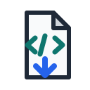

# Idleon-Api-Downloader 🎮


[](https://github.com/manix84/chrome-ext-idleon-data/releases)


[](https://github.com/manix84/chrome-ext-idleon-data/actions/workflows/lint.yml)
[](https://github.com/manix84/chrome-ext-idleon-data/actions/workflows/test.yml)
[](https://github.com/manix84/chrome-ext-idleon-data/actions/workflows/typecheck.yml)
[](https://github.com/manix84/chrome-ext-idleon-data/actions/workflows/release.yml)

<p align="center">
  
</p>

> This icon is a temporary suggested project icon for this merge request. It is intentionally simple and should be replaced if the project owner chooses a better official icon.

A Chrome extension that allows for the downloading of API data in JSON format sent to the browser when Idleon is loaded. Short are the days of manually inputting your character's data into a spreadsheet.

The extension uses Manifest V3 and is now built from TypeScript source.

# How to get 📦

1. Go to the GitHub Releases page for this repository
2. Download the packaged release zip
3. Unzip the file to your location of choice (download folder works fine)
4. Navigate to chrome://extensions in chrome browser
5. Make sure "Developer mode" is checked at the top right of the screen
6. Click "Load unpacked" then select the folder you unzipped
7. You are good to go! You might want to pin the extension for ease of use in game

Please note that I plan on making this extension available on the chrome web store.

# How to use 🚀

The extension is really easy to use once it is installed. Simply navigate to the legends of Idleon website (in Chrome of course) and click play. Once you are on the character selection screen you should be able to open the extension and a series of download/copy links should appear. Enjoy!

The popup now also shows:

1. Last time data was captured
2. Better error icons for parse failures
3. A "Clear Cached Data" button to reset stale captures
4. Capture progress messages when the extension is still waiting for Idleon data

## Options and Debug Logging 🧭

Debug logging is off by default for regular users. Errors are always written to the browser console.

To change the debug level, open the extension options page from Chrome's extension management screen:

1. Navigate to `chrome://extensions`
2. Find Idleon API Downloader
3. Click "Details"
4. Click "Extension options"

The options page supports:

1. `Off` - only errors are logged
2. `Info` - important capture, parsing, copy, and download milestones are logged
3. `Verbose` - detailed capture polling and storage-change diagnostics are logged

Use `Info` or `Verbose` when reporting capture problems, especially if the popup is still waiting for Idleon data. The logs are prefixed with `Idleon API Downloader` and avoid printing raw save payloads.

# Development 🛠️

The extension source lives in `src/js/**/*.ts`. The root repository is source code, not the packaged extension. GitHub Releases contain the compiled extension that should be loaded into Chrome.

## Local setup ⚙️

Install dependencies with the lockfile:

```sh
npm ci
```

Install the repository Git hooks once per checkout so commits can run the version bump helper:

```sh
npm run hooks:install
```

The pre-commit hook bumps `package.json`, `package-lock.json`, and `manifest.json` for releasable changes. It defaults to a patch bump. It chooses a minor bump for broad staged changes, currently 10 or more releasable files, 500 or more changed lines, or 8 or more staged `src/` files.

You can preview the hook's decision for currently staged files:

```sh
npm run version:bump:check
```

Use `VERSION_BUMP=minor git commit ...` to force a minor bump, or `VERSION_BUMP=none git commit ...` to skip the bump intentionally.

## Build and validate ✅

After changing extension files, run:

```sh
npm run build
```

This type-checks the TypeScript source, bundles the module entrypoints into `dist/extension/js`, and copies the static extension files into `dist/extension`.

Run the same checks used by GitHub Actions before opening a pull request:

```sh
npm run lint
npm run typecheck
npm test
npm run validate
```

`npm run validate` builds the compiled extension package and checks the manifest, popup and options page asset references, required popup control IDs, and JavaScript syntax for the files loaded by the extension.

To run only the release package validation locally:

```sh
npm run validate
```

To create the release zip locally, run:

```sh
npm run build:release
```

The release zip is created from `dist/extension`, so it contains compiled JavaScript rather than TypeScript source.

# Privacy 🔒

See [PRIVACY.md](PRIVACY.md) for what the extension captures, where it is stored, and which Chrome permissions are used.

# Community 🤝

See [CONTRIBUTING.md](CONTRIBUTING.md), [CODE_OF_CONDUCT.md](CODE_OF_CONDUCT.md), [SECURITY.md](SECURITY.md), and [SUPPORT.md](SUPPORT.md) before opening issues or pull requests.

No license has been declared for this repository at this time. Do not assume permission to reuse, redistribute, or relicense the code outside this project unless a license is added or explicit permission is given.

The best use of this extension is the ability to copy data that can be easily pasted into the Idleon Calculator import spreadsheet. Doing so will allow you to min/max each of your character and view information the game normally doesn't give you. The spreadsheet is very powerful!

Upon viewing the JSON data, it might seem really messy in a text editor. That is because it is unformatted. Just paste the data into a JSON viewer such as http://jsonviewer.stack.hu/ and it makes viewing the data much easier.

# How does it work? 🔍

Idleon sends all of its game data to your browser as an XMLHttpRequest (XHR for short). The extension takes advantage of that and views the requests just like the game would but instead lets the player see all the data at once.

# How do people use this? 📊

The raw JSON data is really messy and many things about the save data isn't very clear. Things aren't named consistently and there is a lot of extra "JSON" formatting that is unnecessary. I have written scripts to turn this messy data into a "clean" csv, but I also included the original save data in case you want to make your own! If you want to make tools that take advantage of the "clean" JSON, please be warned that it might change in the future as Idleon updates and things need to be re-organized.

# I'm having issues! 🧰

Whether you are trying to use the extension to paste into a spreadsheet or creating a whole new tool for people to use, if you are running into any issues please feel free to reach out to me on the official Idleon discord. I appreciate people who find bugs!

You can also create an issue right here in Github if you like. Simply create a new issue in the "issues" tab at the top of this page.

If you are having issues directly following an update to Idleon, chances are that I'm already working on the fix. Please be patient, but still feel free to message me or create a Github issue if you would like!

If you use multiple accounts, you might need to play on a character, go back to the character selection screen, then reload the page before the extension will work. This occurs as there is a bug with switching accounts and save data in the game itself.

# "How can I help?" 🙌

I put this project on Github for a reason! This is my first project with web development, so things are pretty sloppy in that area. If you think you can contribute in any way, please feel free to make a pull request. It would be much appreciated!

# Special Thanks ✨

[Morta1](https://github.com/Morta1) - For overhauling the frontend to make it look **beautiful**!
